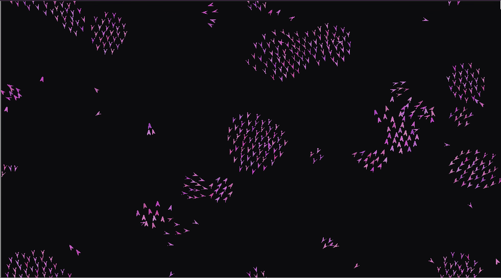

# I made boids!

A Boids simulation implementation in Python using pygame-ce for gui


>*(i have no idea why the gif turned out lagging, I swear the simulation runs fine)*

## Quick Start

Download the repository and install the package with pip:

```bash
# clone repository
git clone https://github.com/ewigael/boids.git
# move to source
cd boids
# install package
pip install .
```

Launch the executable:

```bash
boids
```

Use ```boids -h``` to see a full list of options

## About

A boid in its simplest form is a simulated entity with position and velocity,
governed by three simple rules:
- **separation** - stay away from its neighbors
- **alignment** - match speed and direction of its neighbors
- **cohesion** - move toward the center of the group

From these rules, given a little time, they organise to form flocks!

New behaviors appearing spontaneously from seemingly simple or unrelated rules is called Emergence, and it's everywhere in the Universe.

Boids algorithms are used to simulate bird flocks, schools of fish, [waddles of penguins](https://en.wiktionary.org/wiki/Appendix:English_collective_nouns#The_main_list)... But also enemy AI in video games or even drones

## Why

I realise this is a remarkably beginner-like portfolio project.

I spent a carreer making APIs, web services, scripts and other stuff. I wanted to make something I can see.

I hadn't made a simulation or visual rendering in years and it feels good to tweak this, making things "the right way" just for the sake of it, writing documentation nobody will read...

I just love monitoring. It was interesting creating both the thing and the thing monitoring the thing.

## Configuration

The program will lookup and overlay configuration files in this order:
- `boids/default_conf.toml` (mandatory) -> exhaustive configurables, look there for conf examples
- `~/.config/boids/config.toml`
- data loaded from a save file with `-l`
- file passed through `-c`

see `boids/config.py` to add your own configuration subclasses

## Change logs

Find unreleased features and version updates in the [Changelog](docs/CHANGELOG.md)